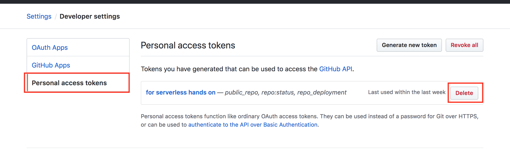

# 리소스 삭제

## CloudFront template 삭제

> 주의: 스택이 완전히 제거 될 때 까지 기다리면서 순서대로 진행하세요.
- [CloudFormation Console](https://console.aws.amazon.com/cloudformation/home?region=ap-southeast-1#/stacks?filter=active&tab=outputs)로 이동 후 다음명령어를 수행하세요.

  ```bash
  aws cloudformation delete-stack --stack-name serverless-hands-on-static-web
  aws cloudformation delete-stack --stack-name delete-stack --stack-name serverless-hands-on-static-web
  aws cloudformation delete-stack --stack-name serverless-hands-on-api-server
  aws cloudformation delete-stack --stack-name serverless-hands-on-pipeline
  aws cloudformation delete-stack --stack-name serverless-hands-on-artifacts-bucket
  # 삭제 되었는지 기다리며 확인합니다.
  ```

## S3 버킷 삭제
- S3는 Bucket에 컨텐츠가 있으면 자동으로 삭제할 수 없습니다. 수동으로 삭제 해주세요.
- [S3 Console](https://s3.console.aws.amazon.com/)로 이동
- delete

## SNS Subscription 삭제
- SNS는 CloudFormation Stack이 제거될때 사라지지만 SNS의 Subscription은 남아있습니다. 수동으로 삭제 해주세요.
- [SNS Console](https://console.aws.amazon.com/sns/v2/home?region=ap-southeast-1#/subscriptions)로 이동
- delete

## Cloud9 삭제
- [Cloud9 Console](https://console.aws.amazon.com/cloud9/home?region=ap-southeast-1#)로 이동
- Delete

## Github access token 삭제
1. [Github Settings](https://github.com/settings/tokens)로 이동
2. `Personal Access Tokens` 클릭
3. `for serverless hands on` token 삭제
    

