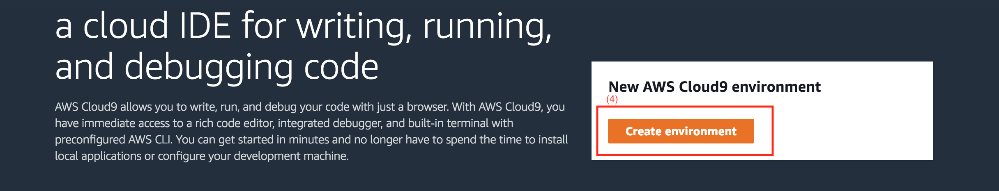
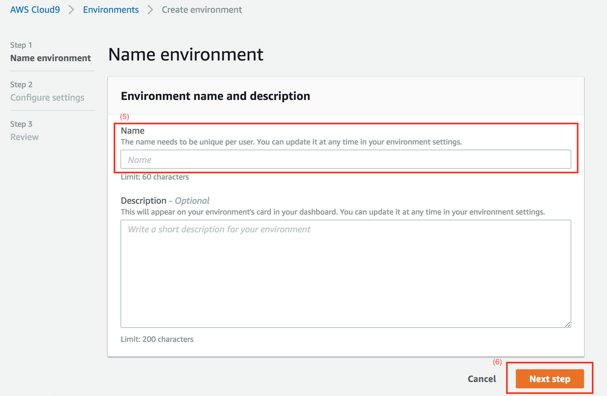
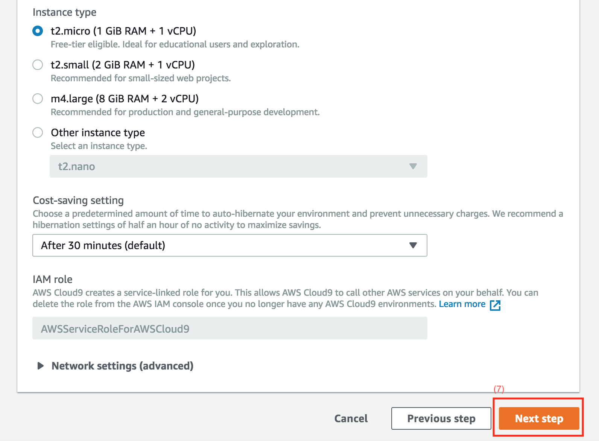
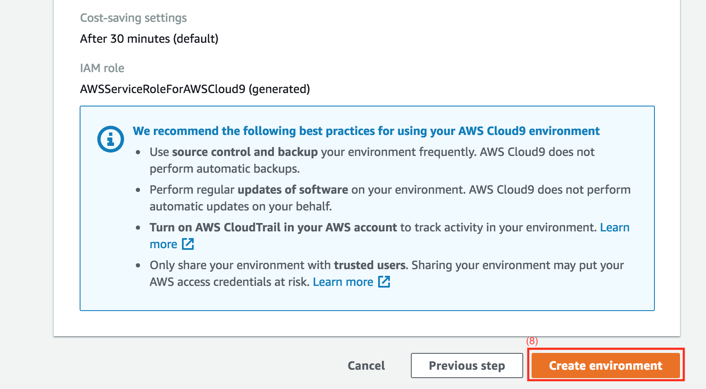
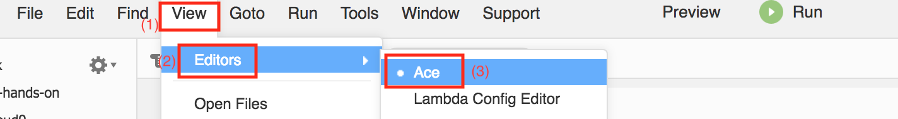
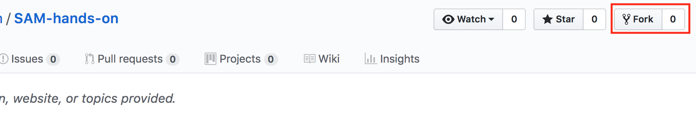

# 개발환경 셋팅하기

## Cloud9

- 개발 환경으로 Cloud9을 사용합니다. 다음의 순서로 생성하여 주십시요.

1. `싱가포르` 리전 선택
2. `서비스` 클릭
3. `Cloud9` 클릭

4. `Create Environment` 클릭

5. `Name` 입력
6. `Next step` 클릭

7. `Next step` 클릭

8. `Create environment` 클릭

9. 생성 완료되면 `View` -> `Editors` 에서 `Ace` 로 템플릿을 변경합니다.


## Github

CI/CD 를 위해 `본인 계정`으로 핸즈온 리파지터리를 `fork` 하요 사용하겠습니다.

1. https://github.com/ChanghoonHyun/SAM-hands-on 로 이동
2. `fork` 클릭
  

> fork 한 뒤에 나오는 화면에서 본인의 리파지터리의 주소를 확인해 주십시요.

## Git cloning

> 이제부터는 Cloud9 터미널에서 작업을 진행합니다. 이후에도 계속 사용할 터미널이니 닫지 마십시요.

1. Git 환경을 설정합니다

    ```bash
    ec2-user:~/environment $ export GITHUB_EMAIL=본인의 깃헙에 사용한 이메일
    ec2-user:~/environment $ export MY_NAME=본인의 이름
    ec2-user:~/environment $ export GITHUB_ACCOUNT=본인의 깃헙 계정
    ec2-user:~/environment $ git config --global user.name $MY_NAME
    ec2-user:~/environment $ git config --global user.email $GITHUB_EMAIL
    ec2-user:~/environment $ git config --global credential.helper cache --timeout=86400
    ```

2. 방금전 fork 받은 본인의 리파지터리를 다음 명령어로 clone 하겠습니다.
    ```bash
    ec2-user:~/environment $ git clone https://github.com/$GITHUB_ACCOUNT/SAM-hands-on.git
    ```


## 다음 단계
- [IaC](../IaC)