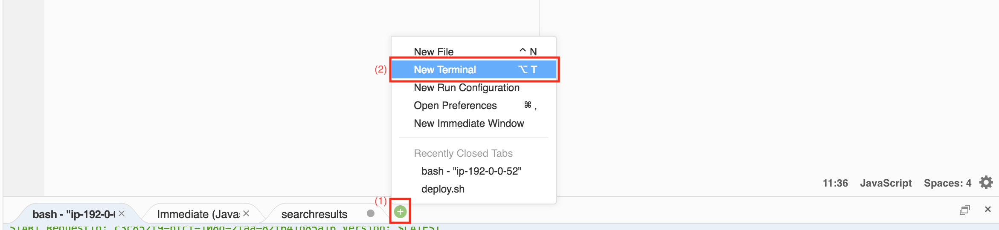
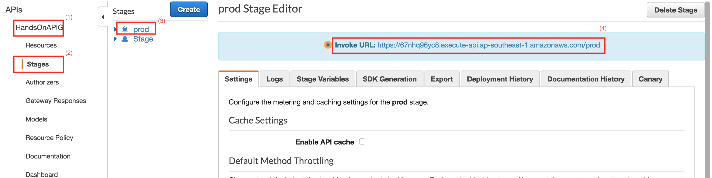
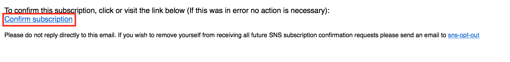
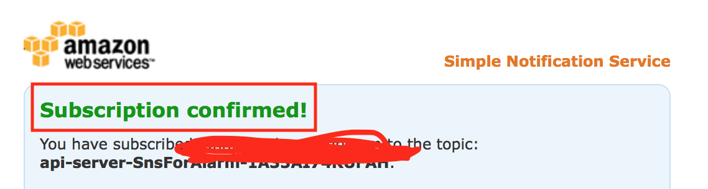
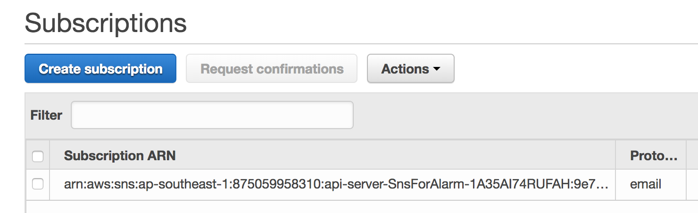

# AWS SAM으로 API 서버 만들기

## AWS SAM

- AWS에서 직접 운영하는 Serverless 플랫폼 입니다.
- 오픈소스 프로젝트 입니다.
- 기존 CloudFomration 리소스 중 serverless 관련 스택들을 간소화 시켰습니다.
  - AWS::Serverless::Function
  - AWS::Serverless::Api
  - AWS::Serverless::SimpleTable

## 패키징된 아티팩트를 저장할 S3 Bucket 만들기

1. 패키지를 빌드 후 생성된 아티팩트를 올릴 S3를 먼저 생성하겠습니다.

    ```bash
    ~/environment $ cd ~/environment/SAM-hands-on/web/artifacts-bucket
    ~/environment/SAM-hands-on/web/artifacts-bucket (master) $ aws \
    cloudformation deploy \
    --template-file template.yaml \
    --stack-name serverless-hands-on-artifacts-bucket \
    --capabilities CAPABILITY_IAM
    ```

2. 아래와 같이 생성에 성공했다는 메시지가 나올때 까지 기다립니다.
    ```bash
    Waiting for changeset to be created..
    Waiting for stack create/update to complete
    Successfully created/updated stack - serverless-hands-on-artifacts-bucket
    ```

3. [S3 Console](https://s3.console.aws.amazon.com/s3/buckets/)을 보면 아래와 같은 이름 형식으로 S3 Bucket 이 생성되었음을 알 수 있습니다.

    > `serverless-hands-on-artifacts-{AccountId}-{Region}`

4. 생성된 S3 Bucket 이름을 변수로 지정합니다.

    ```bash
    # for example, serverless-hands-on-artifacts-100000000001-ap-southeast-1
    export ARTIFACTS_S3=생성된 S3 Bucket 이름
    ```

## 서버 배포하기

1. API server를 수동으로 배포하겠습니다.
    - 장애 알람을 통지받을 email 주소는 앞서 입력한 Github 의 email 을 이용하겠습니다.

    ```bash
    export SNS_EMAIL=$GITHUB_EMAIL
    ```

    ```bash
    ec2-user:~/environment/SAM-hands-on/web/artifacts-bucket (master) $ cd ~/environment/SAM-hands-on/web/backend

    ec2-user:~/environment/SAM-hands-on/web/backend (master) $ npm i aws-xray-sdk

    ec2-user:~/environment/SAM-hands-on/web/backend (master) $ aws \
      cloudformation package \
      --template template.yaml \
      --s3-bucket $ARTIFACTS_S3 \
      --output-template packaged.yaml

    ec2-user:~/environment/SAM-hands-on/web/backend (master) $ aws \
      cloudformation deploy \
      --template-file packaged.yaml \
      --stack-name serverless-hands-on-api-server \
      --capabilities CAPABILITY_NAMED_IAM \
      --parameter-overrides \
      Email=$SNS_EMAIL  
    ```    

2. [CloudFormation Console](https://ap-southeast-1.console.aws.amazon.com/cloudformation)로 이동

   `serverless-hands-on-api-server` 스택이 생성된 것을 확인 할 수 있습니다.


## local 확인

1. sam local 을 실행하여 로컬에서 start-api 서버를 띄워봅니다.
    ```bash
    ec2-user:~/environment/SAM-hands-on/web/backend (master) $ sam local start-api --port 3000
    ```

2. Cloud9에서 새로운 터미널을 열어 서비스의 정상 동작 여부를 확인합니다.

    - 새 터미널은 이렇게 열어볼 수 있습니다.
    

    - 새 터미널에서 다음을 입력하여 확인합니다.

      ```bash
      ~/environment $ curl --request POST --header 'Content-Type: application/json' --data '{"name":"test"}' http://127.0.0.1:3000/users
      ~/environment $ curl --request GET http://127.0.0.1:3000/users
      ```

    - 이렇게 하면 방금 등록한 test 가 표시됩니다.

3. start-api 서버를 실행한 터미널에서 ctrl + C 를 눌러 로컬 실행을 종료합니다.

    > 처음부터 사용했던 터미널을 말합니다.


### API Gateway

#### 콘솔에서 확인하기

[APIGateway console](https://ap-southeast-1.console.aws.amazon.com/apigateway)로 이동해서 생성된 API Gateway를 확인할 수 있습니다.

1. `HandsOnAPIG` 클릭
2. `Stages` 클릭
3. `prod` 클릭
4. `Invoke URL` 확인
    > 이 주소는 다음 장에서 사용하니 따로 메모해 둡니다.

    - https://`{your-apig-arn}`.execute-api.`{region}`.amazonaws.com/prod

    
    

#### template(AWS::Serverless::Api) 살펴보기
```yaml
  UsersApi:
    Type: AWS::Serverless::Api
    Properties:
      # API Gateway 이름
      Name: !Ref APIGName
      # Stage 이름
      StageName: !Ref StageName
      DefinitionBody:
        swagger: "2.0"
        paths:
          "/users":
            get:
              responses:
                "200":
                  content:
                    text/plain:
                      scheme:
                        $ref: "#/definitions/Empty"
              x-amazon-apigateway-integration:
                httpMethod: POST
                type: aws_proxy
                # 호출할 lambda arn(Amazon Resource Namespace)을 매핑합니다.
                uri: !Sub "arn:aws:apigateway:${AWS::Region}:lambda:path/2015-03-31/functions/${MainFunction.Arn}:${LambdaAlias}/invocations"
            post:
              responses:
                "200":
                  content:
                    text/plain:
                      scheme:
                        type: string
              x-amazon-apigateway-integration:
                httpMethod: POST
                type: aws_proxy
                uri: !Sub "arn:aws:apigateway:${AWS::Region}:lambda:path/2015-03-31/functions/${MainFunction.Arn}:${LambdaAlias}/invocations"
```  

#### template(AWS::Serverless::Function) 살펴보기

```yaml
  UsersFunction:
    Type: AWS::Serverless::Function
    Properties:
      CodeUri: ./
      Handler: index.handler
      Runtime: nodejs8.10
      MemorySize: 128
      Timeout: 10
      # X-Ray 사용
      Tracing: Active
      # 배포된 버전의 별칭
      AutoPublishAlias: !Ref LambdaAlias
      # 환경변수 설정
      Environment:
        Variables:
          tableName: !Ref UsersTableName
      # IAM Policies
      Policies:
        # AWS Managed Policy
        - AWSLambdaBasicExecutionRole
        - AWSXrayWriteOnlyAccess
        # Custom Policy
        - Version: "2012-10-17"
          Statement:
            - Effect: Allow
              Action:
                - logs:CreateLogStream
                - logs:PutLogEvents
              Resource: !Sub arn:aws:logs:${AWS::Region}:${AWS::AccountId}:log-group:/aws/lambda/*
            - Effect: Allow
              Action:
                - dynamodb:PutItem
                - dynamodb:Scan
              Resource: !Sub arn:aws:dynamodb:${AWS::Region}:${AWS::AccountId}:table/${UsersTableName}
      # Event source list
      Events:
        UsersGet:
          Type: Api
          Properties:
            Path: /users
            Method: GET
            RestApiId: !Ref UsersApi
        UsersPost:
          Type: Api
          Properties:
            Path: /users
            Method: POST
            RestApiId: !Ref UsersApi
      DeploymentPreference:
        # 배포 정책
        Type: !Ref DeploymentType
        # 알람
        Alarms:
          - LambdaAliasErrorMetricGreaterThanZeroAlarm
          - LambdaErrorMetricGreaterThanZeroAlarm
``` 

#### template(AWS::Serverless::SimpleTable) 살펴보기
```yaml
  UsersTable:
    Type: AWS::Serverless::SimpleTable
    Properties:
      TableName: !Ref UsersTableName
      PrimaryKey:
        Name: id
        Type: String
      # 미리 정의된 사용량
      ProvisionedThroughput:
        ReadCapacityUnits: 1
        WriteCapacityUnits: 1
```

### SNS

- 위에 입력한 주소(Github 에 등록한 email)로 `AWS SNS` 의 subscription을 확인하는 이메일이 올 것입니다.
- 이메일 제목은 `AWS Notification - Subscription Confirmation` 입니다.
- 메일에서 `Confirm subscription`을 눌러서 subscribe 합니다.
  
- `Confirm subscription`을 누르면 아래와 같은 화면으로 리다이렉트 됩니다.
   
- [SNS Console](https://console.aws.amazon.com/sns/v2/home?region=ap-southeast-1#/subscriptions)로 이동해서 정상적으로 구독되었는지 확인합니다. `Subscription ARN`이 `PendingConfirmation`이라면 아직 `Confirm subscription`이 안된 것입니다. 이메일을 확인해서 `Confirm subscription`을 눌러주세요. 
  


## 다음 단계
- [AWS Static Web으로 SinglePageApp 만들기](../frontend)