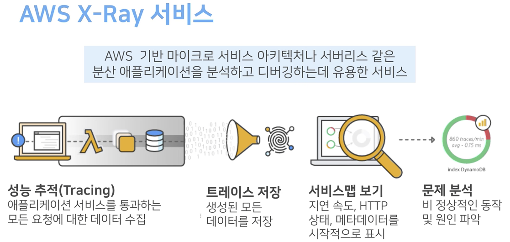
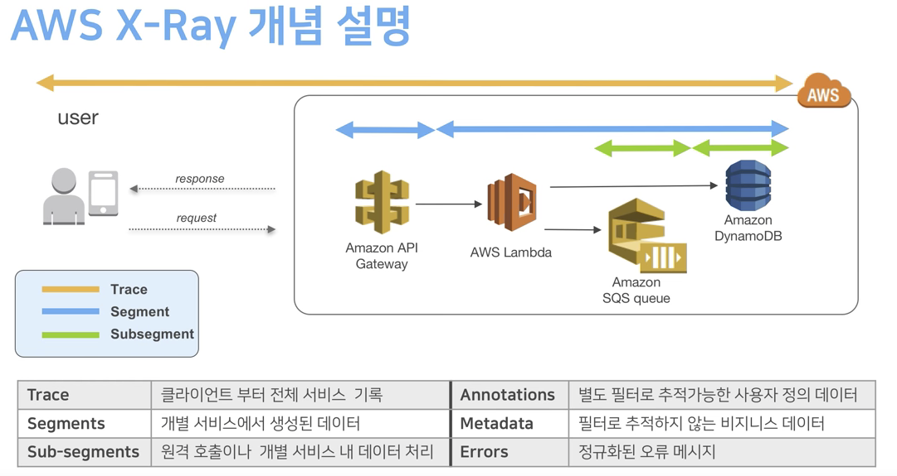
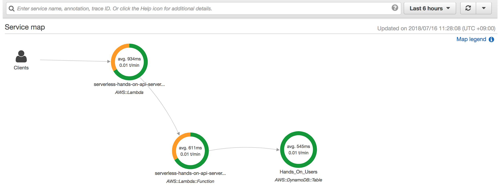
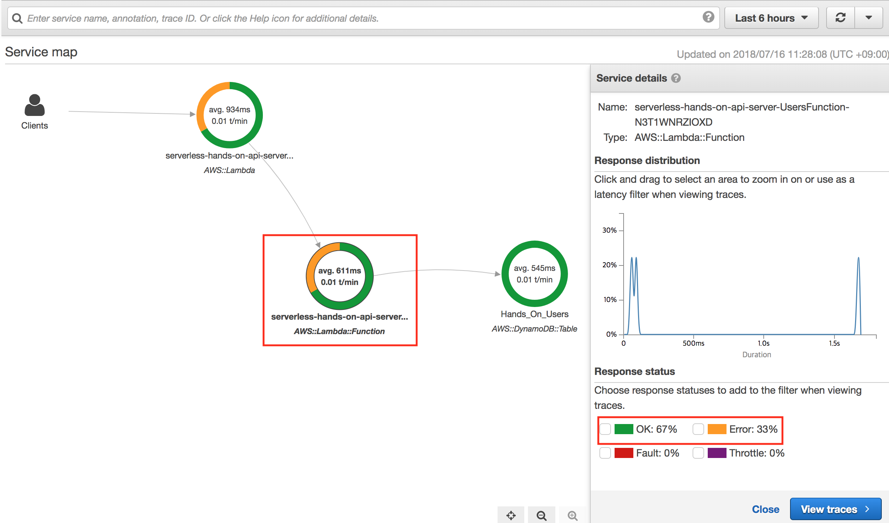
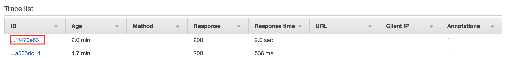
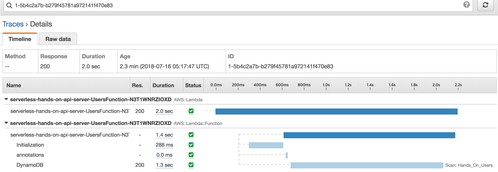
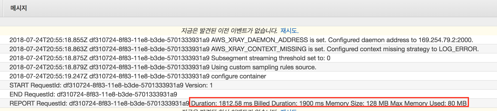
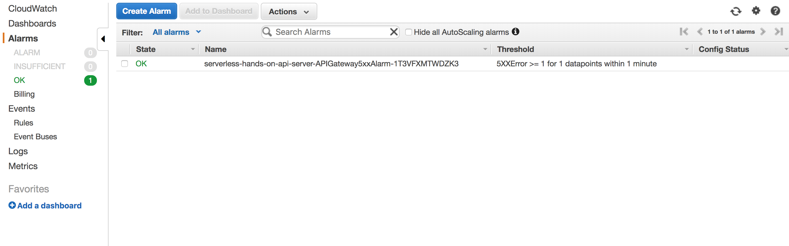

# 웹 서비스 모니터링 하기

## X-Ray

어플리케이션의 성능, 동작 등을 추적 할 수 있는 프로파일 도구입니다.
시각화, 상세 도표 등을 제공하고 검색이 가능합니다.
트레이스 데이터는 30일간 저장이 가능합니다.



[출처: 윤석찬님의 AWS X-Ray를 통한 서버리스 분산 애플리케이션 추적하기](https://www.youtube.com/watch?v=BEg__eV1mT8)

- X-Ray Daemon
  - X-Ray SDK를 통해서 전달된 내용을 정리해서 AWS X-Ray로 전송
  - Lambda에서는 X-Ray Daemon이 기본적으로 내장 돼있으며 Trace 옵션을 이용해서 X-Ray Daemon을 활성화 시킬 수 있습니다.
- Segments
  - 요청, 응답 정보 기록
  - 시작, 종료시간 기록
  - 에러 스택 기록
  - SubSegments 기록
- SubSegments
  - AWS Clients, 외부 API, 임의의 메소드 등의 정보를 기록
- Annotations
  - X-Ray에서 인덱싱 돼서 필터 표현식을 사용 할 수 있는 필드
- MetaData
  - X-Ray에서 인덱싱 되지 않는 세그먼트의 데이터


### backend/index.js의 X-Ray 사용

1. `Lambda`에서 `Tracing`을 활성화 합니다.
    ```yaml
      UsersFunction:                        
        Type: AWS::Serverless::Function
        Properties:
          # X-Ray 사용
          Tracing: Active
    ``` 

2. `aws-xray-sdk`를 import해서 `X-Ray`의 `SamplingRules`를 셋팅합니다.
    > 주의! 본 예제에서는 X-Ray 동작 확인을 위해서 샘플링 비율을 1로 했습니다. 실제로 사용할 때는 적절한 샘플링 비율을 선택해주세요.

    ```javascript
    const AWSXRay = require('aws-xray-sdk');
    const rules = {
        "rules": [{ "description": "users", "service_name": "*", "http_method": "*", "url_path": "/users/*", "fixed_target": 0, "rate": 1 }],
        "default": { "fixed_target": 1, "rate": 1 },
        "version": 1
    };
    AWSXRay.middleware.setSamplingRules(rules);
    ```

3. `aws-sdk`의 모든 클라이언트를 `X-Ray`가 추적 가능하도록 wrapping합니다.

    ```javascript
    const AWS = AWSXRay.captureAWS(require('aws-sdk'));
    ```    

4. `SubSegment`를 생성해서 `annotation` 과 `metadata`를 추가합니다.

    ```javascript
        const initSubSegment = (subsegment) => {
            subsegment.addAnnotation('functionVersion', context.functionVersion);
            subsegment.addMetadata('meta', context.awsRequestId);
        };
        AWSXRay.captureFunc('annotations', initSubSegment);
    ```

### X-Ray Service Map 확인하기

- [XRay Console](https://console.aws.amazon.com/xray/home?region=ap-southeast-1#/service-map?timeRange=PT6H)로 이동
  
  
  - error: 클라이언트 오류(4xx)
  - fault: 서버 오류(5xx)
  - throttle: 요청 과다로 인한 제한(429)

### X-Ray Traces 확인하기
  - [Xray Console](https://console.aws.amazon.com/xray/home?region=ap-southeast-1#/traces?timeRange=PT6H)로 이동
  
    

## CloudWatch Logs
- Agent를 통해서 로그를 수집하고 로그에 엑세스 합니다.
  
  - RequestId : 요청을 추적하기 위해 할당된 id
  - Duration : 람다가 실행된 시간
  - Billed Duration : Duration을 100ms 단위로 올림한 과금용 시간
  - Memory Size : 람다에 할당된 메모리
  - Max Memory Used : 사용한 메모리 사이즈
- [필터 패턴](https://docs.aws.amazon.com/ko_kr/AmazonCloudWatch/latest/logs/FilterAndPatternSyntax.html)을 통한 검색


## CloudWatch Metrics
- [CloudWatch Console](https://console.aws.amazon.com/cloudwatch/home?region=ap-southeast-1#dashboards:name=HandsOnAPIG)로 이동
- 5xx와 Latency에 대한 Metrics를 대시보드로 만들었습니다.

### API Gateway Metrics
- 4XXError
- 5XXError
- CacheHitCount
- CacheMissCount
- Count
- IntegrationLatency
- Latency

### 그 외의 Metrics 정보
- [리소스별 Metrics](https://docs.aws.amazon.com/ko_kr/AmazonCloudWatch/latest/monitoring/CW_Support_For_AWS.html)
- [Custom Metrics](https://aws.amazon.com/ko/blogs/korea/amazon-cloudwatch-custom-metrics/)

### template 살펴보기
```yaml
  ApiDashboard:
    Type: AWS::CloudWatch::Dashboard
    Properties:
      DashboardName: !Ref APIGName
      DashboardBody: !Sub '
      {
        "widgets":[
          {
            "type":"metric",
            "x":0,
            "y":0,
            "width":12,
            "height":6,
            "properties":{
              "metrics":[
                [
                  "AWS/ApiGateway",
                  "5XXError",
                  "ApiName",
                  "${APIGName}"
                ]
              ],
              "period":300,
              "stat":"Sum",
              "region":"${AWS::Region}",
              "title":"5xx error metric"
            }
          },
          {
            "type":"metric",
            "x":0,
            "y":0,
            "width":12,
            "height":6,
            "properties": {
              "metrics":[
                [
                  "AWS/ApiGateway",
                  "Latency",
                  "ApiName",
                  "${APIGName}"
                ]
              ],
              "period":300,
              "stat":"Sum",
              "region":"${AWS::Region}",
              "title":"Latency metric"
            }
          }
        ]
      }'
```

## CloudWatch Alarm
- [CloudWatch Console](https://console.aws.amazon.com/cloudwatch/home?region=ap-southeast-1#alarm:alarmFilter=ANY)로 이동
  
- 경보 상태의 기준을 설정하고 경보 상태가 되면 Notification
- 측정 간격(Period) 동안 데이터 포인트(EvaluationPeriods) N개 중 M개가 임계값(Threshold)을 초과할 경우 경보를 제공
  - Period가 60초라면 60초에 DataPoint 1개 생성
  - 60초동안 1번 이상 5xx 에러가 발생하면 Alarm status로 변경

### template 살펴보기
```yaml
  APIGateway5xxAlarm:
    Type: AWS::CloudWatch::Alarm
    DependsOn: UsersApi
    Properties:
      AlarmDescription: 5xx alarm for api gateway
      Namespace: AWS/ApiGateway
      AlarmActions:
        - !Ref SnsForAlarm
      OKActions:
        - !Ref SnsForAlarm
      MetricName: 5XXError
      Dimensions:
        - Name: ApiName
          Value: !Ref APIGName
      Statistic: Sum
      Period: 60
      EvaluationPeriods: 1
      Threshold: 1
      ComparisonOperator: GreaterThanOrEqualToThreshold
```

## 다음 단계
- [CI/CD Pipeline](../pipeline)